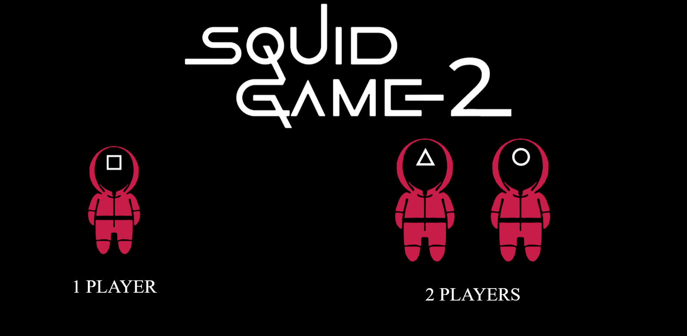
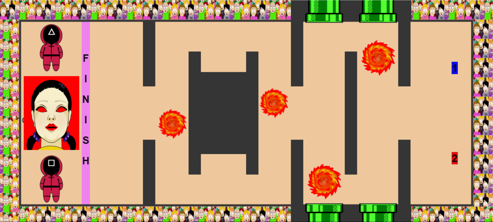

# SQUID GAME

## Introduction

Squid Game is a game I built as a project for IronHack Barcelona during week 3. 
My game is about TIMING. You have to sort the labyrinth to reach the finish line. 
You can only move when the giant doll is singing, if you break this rule prepare for a terrible death. But beware of the fireballs! 
Calculate the time well to reach the safe zones to stop.

   

## Game Instruction
- Player 1 - move with the arrow keys (up, down, left, right)
- Player 2 - move with the "w" "s" "a" "d"  keys (up, down, left, right)
- Don't touch the fireballs or you lose.
- Don't move when the doll is not singing (red background on doll) or you lose.
- Get to the finish line to win.

- [Click to play](https://ortegapedro88.github.io/squid-game/)

- Enjoy!

## Used technologies
- Vanilla JavaScript
- Canvas HTML element to draw